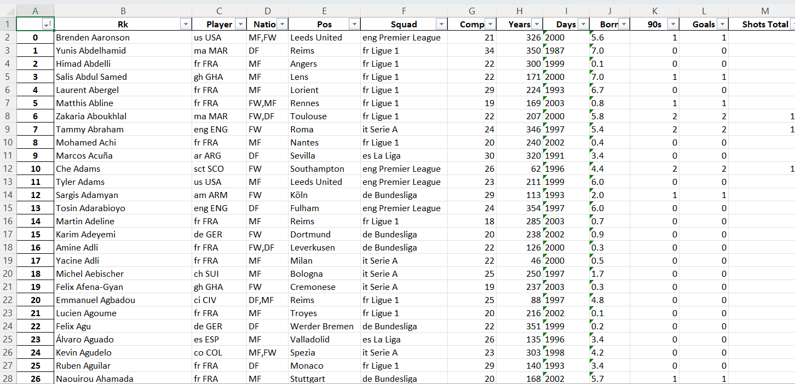
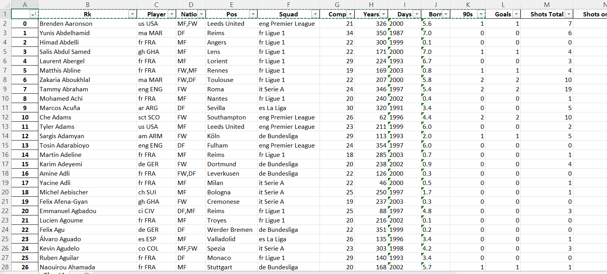
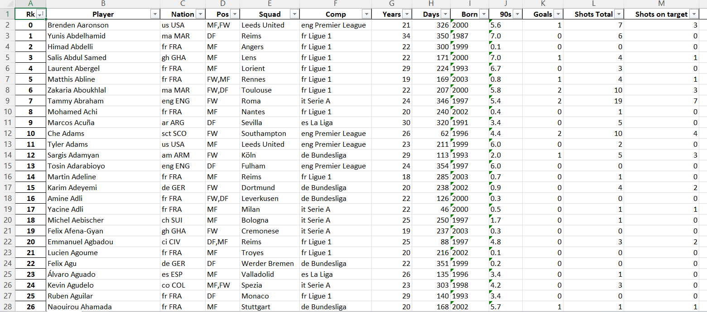

# FBRef_data_scraper

This is a project to allow users of the popular
public statistic website FBRef to collate all
the sections they need together into one single
Excel document, meaning that you do not have to
fiddle around with multiple workbooks and downloads
that can just be a pain and take such a long time.

##Usage
To use, simply take the repo, run it and then
within the project's directory it will have the
"test.xlsx" file containing all of the numbers
for you to deep dive into

##Issues
Currentlyin the first version of the application,
there is an issue whereby the player details
columns are shifted one to the right, and the "Goals"
column is duplicated. This will be fixed in future versions
however for now follow these steps to fix the problem:

Above is a sample image of when you run the file
(I have parsed the years and days in this one but 
that does not matter for this problem).

Copy and paste in the details headers shifted one to
the left (as above) and delete the duplicated 
column. With this, you have your completed and
correctly formatted.

##Disclaimers
I do not own any of the data, all is supplied by Statsbomb
via FBRef and all of the info is public and free, 
I am simply giving this project to make it easier to use.

Also if anyone uses I would appreciate a tag,
my Twitter handle is @T__C__D. Thanks :)
